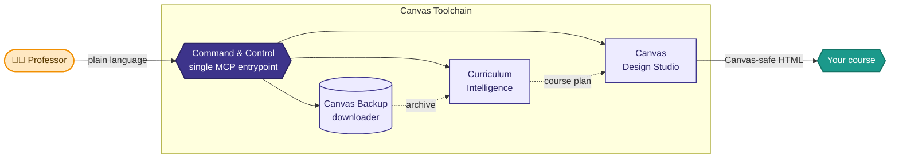
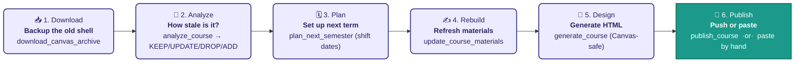
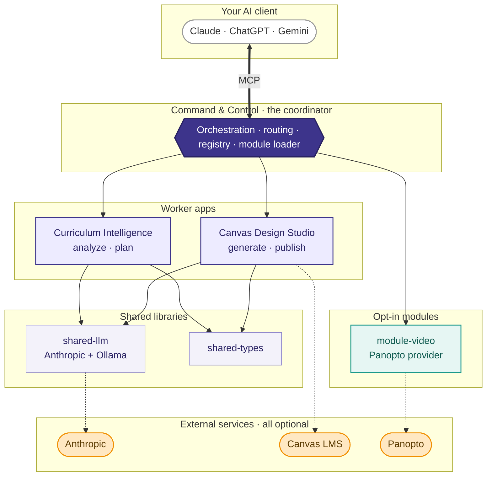
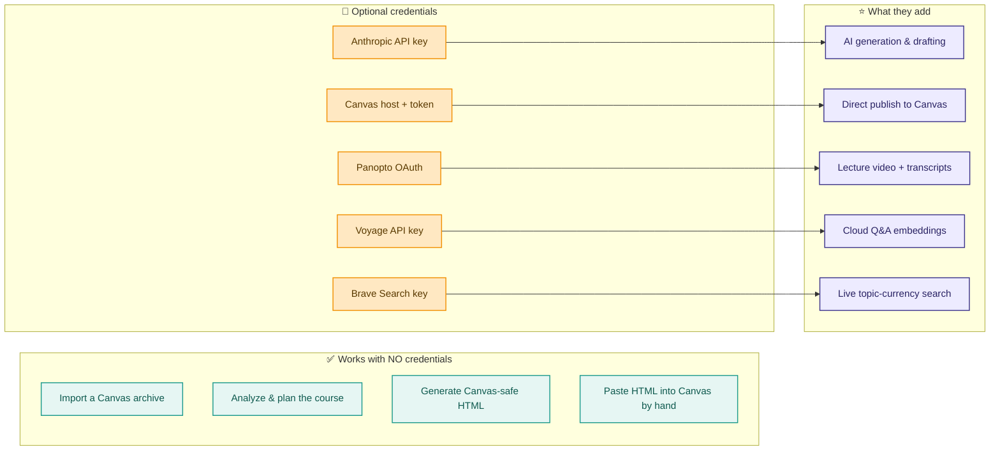
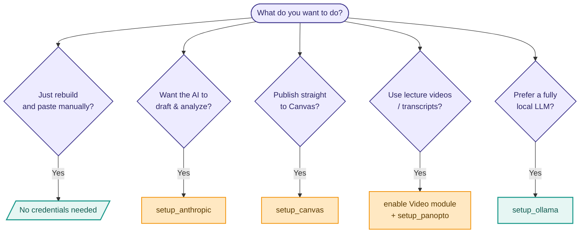
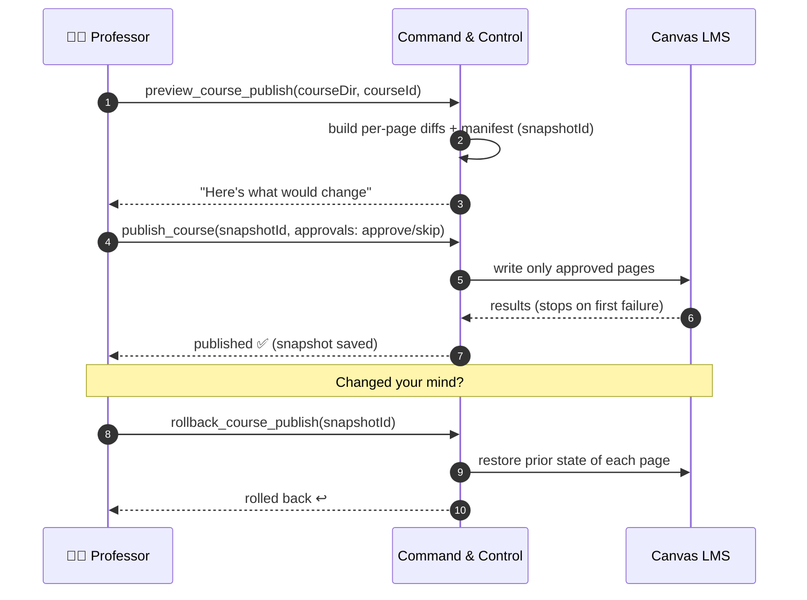
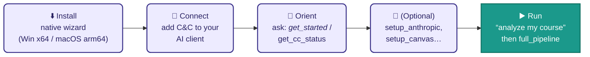

# Canvas Toolchain — Visual Guide

A picture-first tour of what the toolchain is, how the pieces fit, and how you actually use it.
All diagrams below are **Mermaid** — they render automatically on GitHub and in most Markdown viewers.
A companion hand-drawn **Excalidraw** scene lives at [`pipeline.excalidraw`](pipeline.excalidraw) (open it at <https://excalidraw.com>).
Every diagram below is also exported to **PNG and SVG** under [`images/`](images/) (re-render from the `.mmd` sources with `mmdc`).
New here? Read the [**User Guide & Tutorial**](../user-guide.md) first. For the full text reference, see [`../commands-and-credentials.md`](../commands-and-credentials.md).

---

## 1. The big idea — one entrypoint, one semester loop

You talk to **Command & Control** in plain language from any AI client. It runs the whole loop for you.

---

## 2. The semester-refresh pipeline

The core job: take last semester's course, figure out what's stale, rebuild it, and ship it.

> 💡 Steps 2–4 are one command each, or run all of them with **`full_pipeline`**.
> Step 6 is **always optional** — the "generate HTML and paste it into Canvas yourself" path needs zero credentials.

---

## 3. How the pieces fit (architecture)

---

## 4. Credentials → what each one unlocks

**Everything works with zero keys.** Each credential just turns on one optional enhancement.

> 🔒 Every key is stored locally under `~/.command-and-control/` with `0o600` permissions, validated before saving, and never echoed back or sent to analytics.

---

## 5. "Which setup do I need?" — decision guide

---

## 6. Safe publishing — preview, approve, roll back

Publishing to Canvas is gated: nothing is written until you approve each page, and every publish can be undone.

---

## 7. First 15 minutes — getting started

---

## 8. Prompts for graphic-creation tools

Use these to produce polished hero art, banners, and icons in Midjourney, DAL·E·3, Adobe Firefly, Ideogram, or Stable Diffusion. The palette throughout: **deep indigo `#3D348B`**, **teal `#1B998B`**, **warm amber `#F18F01`**, soft off-white backgrounds.

### A. Hero banner (README / docs header)
> A clean, modern flat-illustration banner showing a friendly university professor at a laptop, with a glowing left-to-right pipeline of five connected rounded cards floating beside them labeled conceptually as Download, Analyze, Plan, Design, Publish. Deep indigo (#3D348B) and teal (#1B998B) accents on a soft off-white background, subtle amber (#F18F01) highlights, thin connecting lines with small arrowheads, generous negative space, vector style, no text, 3:1 aspect ratio, crisp and professional, editorial tech-illustration aesthetic.

### B. App icon / logo mark
> A minimalist app icon: an abstract mark combining a graduation cap and a refresh/cycle arrow forming a continuous loop, geometric and balanced, deep indigo and teal duotone with a single amber spark, flat vector, rounded-square badge, subtle soft shadow, centered, no text, high contrast, scalable logo style.

### C. "How it works" isometric diagram
> Isometric 3D illustration of a small software pipeline as connected glossy blocks on a light surface: an archive box flowing into a magnifying-glass analysis node, into a calendar planning node, into a paintbrush design node, into a rocket publish node. Indigo/teal/amber palette, soft ambient occlusion, clean studio lighting, friendly rounded shapes, white background, no text labels, vector-isometric infographic style, 16:9.

### D. Section spot illustrations (set of 5, consistent style)
> A set of five matching flat line-icon spot illustrations in a consistent style, each on its own soft off-white tile with rounded corners, two-tone indigo (#3D348B) line work with teal (#1B998B) fills and tiny amber (#F18F01) accents: (1) a download cloud over a folder, (2) a magnifying glass over a document with checkmarks, (3) a calendar with shifting date arrows, (4) a paintbrush painting a webpage card, (5) a rocket launching from a browser window. Thin uniform stroke weight, minimal, modern, no text.

### E. Security / trust illustration (for the credentials section)
> A reassuring flat illustration of a padlock over a single local folder on a laptop, with small key icons resting safely inside, faint dashed lines to cloud services shown as optional and dimmed. Calm indigo and teal palette with one amber key, soft background, conveys "keys stay local and optional," vector style, generous whitespace, no text, 4:3.

**Tips:** append your platform's quality tags (Midjourney: `--ar 3:1 --style raw --v 6`; SD/Firefly: add `flat vector illustration, high detail, clean composition`). Keep "no text" in prompts — add titles yourself afterward so typography stays crisp.

---

## 9. Where to go next

| You want… | Go to |
| --- | --- |
| Every command + parameter | [`../commands-and-credentials.md`](../commands-and-credentials.md) §2 |
| Every secret + why | [`../commands-and-credentials.md`](../commands-and-credentials.md) §3 |
| To edit these diagrams visually | [`pipeline.excalidraw`](pipeline.excalidraw) at excalidraw.com |
| Contributor orientation | [`../../AGENTS.md`](../../AGENTS.md) |
</content>
