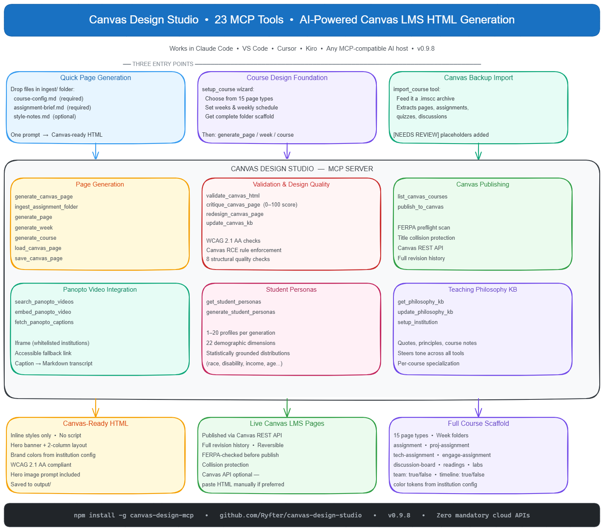

# Canvas Toolchain — Design Studio

**An MCP server that gives AI assistants the power to generate, validate, and maintain beautiful Canvas LMS assignment pages.**

Works in Claude Code, VS Code, ChatGPT Codex, and any MCP-compatible host. Zero mandatory cloud APIs — your Canvas API token is optional.

---



---

## What It Does

| Tool | What it does |
|---|---|
| `get_started` | Get a tailored orientation based on your current config — what tools are active, what setup unlocks, quick-start prompts, and a Context7 hint. Call this at the start of any session. |
| `generate_canvas_page` | Turns a raw assignment brief into polished, Canvas-safe HTML with a hero banner, two-column layout, and brand colors |
| `validate_canvas_html` | Checks HTML against Canvas RCE sanitizer rules and WCAG 2.1 AA accessibility checks |
| `update_canvas_kb` | Fetches the current Canvas HTML allowlist directly from Canvas LMS source and reports any changes |
| `setup_institution` | Runs the setup wizard to save brand colors, Canvas URL, API token, brand standards URL, and Panopto config — returns a formatted setup summary when done |
| `list_canvas_courses` | Lists your Canvas courses with semester filtering, student counts, and favorite pinning to help choose the right one |
| `publish_to_canvas` | Validates and publishes generated HTML directly to a Canvas course page — with FERPA preflight and title collision protection |
| `critique_canvas_page` | Scores visual design quality (0–100) with 8 structural checks, strengths, and prioritized findings |
| `redesign_canvas_page` | Applies mechanical fixes (font floor, hero placeholder) and returns remaining findings for the AI to address |
| `search_panopto_videos` | Browse or search your Panopto lecture library — titles, durations, captions status (requires Panopto API) |
| `embed_panopto_video` | Generate Canvas-safe Panopto embed HTML — iframe for whitelisted institutions, accessible fallback link otherwise |
| `fetch_panopto_captions` | Download Panopto captions, strip timestamps, save as a plain-text Markdown transcript to your local KB |
| `ingest_assignment_folder` | Read assignment materials from a folder (course config, brief, rubric, shell) and generate a Canvas page in one step |
| `get_philosophy_kb` | Load your teaching philosophy KB into the AI's context — steers tone, emphasis, and pedagogy across all tools |
| `update_philosophy_kb` | Add a quote, teaching insight, lecture-sourced statement, or course-specific note to your philosophy KB |
| `get_student_personas` | Load saved student personas — statistically grounded demographic profiles for realistic audience feedback |
| `generate_student_personas` | Generate 1–20 student personas using real probability distributions for race, disability, and 21 other dimensions |
| `load_canvas_page` | Read the most recently generated HTML page from `output/` back into context (or load a named file) |
| `save_canvas_page` | Write improved HTML back to `output/` — automatically backs up the previous version before overwriting |
| `setup_course` | Run once per course: choose page types from a checklist, set weeks, get a complete folder scaffold pre-filled with content prompts |
| `generate_page` | Generate or regenerate a single Canvas page from its `.md` source file |
| `generate_week` | Generate all pages for one week at once |
| `generate_course` | Batch generate the entire course in one command |
| `import_course` | Seed a course folder from a Canvas backup archive — extracts pages, assignments, quizzes, and discussions with `[NEEDS REVIEW]` placeholders for content that can't be auto-extracted |

---

## Quick Start

### Option A — npm global install

```bash
npm install -g @canvas-toolchain/canvas-design-studio
```

Then add to your MCP client config:

```json
{
  "mcpServers": {
    "canvas-toolchain-design-studio": {
      "command": "canvas-toolchain-design-studio"
    }
  }
}
```

**Claude Desktop** — `%APPDATA%\Claude\claude_desktop_config.json` (Windows) or `~/Library/Application Support/Claude/claude_desktop_config.json` (macOS)  
**VS Code** — `.vscode/mcp.json` (use `"servers"` key, not `"mcpServers"`)  
**Cursor, Kiro, LM Studio, AnythingLLM, Codex CLI** — see [docs/installation.md](docs/installation.md) for client-specific config

### Option B — Docker (no Node.js required)

Docker has two steps:

1. **Download the image** so it exists on your computer.
2. **Tell your AI app how to start it** by adding the JSON config below to that app's MCP settings.

The JSON is not a PowerShell command. It is a configuration snippet for Claude Desktop, Cursor, LM Studio, and other MCP clients.

```bash
# Pull the image
docker pull ghcr.io/ryfter/canvas-design-studio:latest
```

Run the setup wizard once so Canvas Design Studio can save your school colors, Canvas URL, and optional API token.

Windows PowerShell:

```powershell
docker run -it --rm -v "$HOME\.canvas-design-mcp:/root/.canvas-design-mcp" ghcr.io/ryfter/canvas-design-studio:latest
```

macOS Terminal:

```bash
docker run -it --rm -v "$HOME/.canvas-design-mcp:/root/.canvas-design-mcp" ghcr.io/ryfter/canvas-design-studio:latest
```

Linux terminal:

```bash
docker run -it --rm -v "$HOME/.canvas-design-mcp:/root/.canvas-design-mcp" ghcr.io/ryfter/canvas-design-studio:latest
```

After the wizard finishes, add this to your MCP client config:

```json
{
  "mcpServers": {
    "canvas-design": {
      "command": "docker",
      "args": [
        "run", "-i", "--rm",
        "-v", "${HOME}/.canvas-design-mcp:/root/.canvas-design-mcp",
        "ghcr.io/ryfter/canvas-design-studio:latest"
      ]
    }
  }
}
```

That `-v` line is the important part: it lets the temporary Docker container read the saved config from your computer. Without that mount, the container starts fresh every time and will not remember your institution settings.

If your AI app does not expand `${HOME}` correctly, replace it with your full home folder path:

- Windows: `C:/Users/YOUR-USERNAME/.canvas-design-mcp:/root/.canvas-design-mcp`
- macOS: `/Users/YOUR-USERNAME/.canvas-design-mcp:/root/.canvas-design-mcp`

Common config locations:

- **Claude Desktop on Windows:** `%APPDATA%\Claude\claude_desktop_config.json`
- **Claude Desktop on macOS:** `~/Library/Application Support/Claude/claude_desktop_config.json`
- **Cursor:** `~/.cursor/mcp.json`
- **LM Studio:** `~/.lmstudio/mcp.json`
- **Codex CLI:** uses TOML instead of this JSON; see [docs/installation.md](docs/installation.md)

After saving the config, fully restart the AI app. The app will run Docker for you whenever it needs the Canvas Design Studio tools.

### What the Setup Wizard Asks

Whether you use npm or Docker, the first setup run asks:

```
╔═══════════════════════════════════════════════════════════╗
║          Canvas Design Studio — First Run Setup           ║
╚═══════════════════════════════════════════════════════════╝

Institution name (your college or university): (Example University)
Brand standards URL (optional — your AI fetches this to suggest your colors):
Primary brand color (#hex): (#0033A0)
Secondary / accent color (#hex): (#D64309)
Canvas base URL (no trailing slash): (https://example.instructure.com)
Canvas API token — Account → Settings → Approved Integrations (optional):
Professor email for FERPA scan allowlist (optional):
Favorite Canvas course IDs, comma-separated (optional):
```

When the wizard finishes it prints a formatted setup summary showing your settings and what you can do right now. Ask your AI to save it as `my-canvas-setup.md` for reference.

Config saves to `~/.canvas-design-mcp/institution.json` (legacy data-dir name for Design Studio config; not the npm package name) — survives `npx` reinstalls.

**New to Canvas Design Studio?** See `docs/start_here.md` for a full orientation, or run `get_started` at the beginning of any session for a tailored overview of what's active.

---

## Generating a Page

Ask your AI assistant:

> "Generate a Canvas assignment page for ITM 370, Assignment 16.06 — AI Augmented Projects, Fall 2026, Dr. Smith. Brief: Students record a 5-minute video demo of their passion project and upload to YouTube."

The tool returns:

- **Canvas-safe HTML** — inline styles only, no `<script>`, no disallowed properties
- **Hero image prompt** — copy/paste into ChatGPT or Midjourney (1200×400px)
- **Filename** — `itm-370-16.06-page.html`

---

## Canvas HTML Rules Enforced

The validator and generator both enforce Canvas RCE constraints:

| Disallowed | Reason |
|---|---|
| `<style>` blocks | Canvas strips them — use inline `style=""` |
| `<script>` | Not permitted in Canvas RCE |
| `box-shadow` | Stripped by sanitizer |
| `opacity` | Stripped — use `rgba()` instead |
| `gap` | Stripped in flex/grid — use `margin` on children |
| `filter`, `transform`, `transition`, `animation` | All stripped |
| `<h1>` | Reserved for Canvas page title |
| `` without `alt` | Accessibility violation |

---

## Accessibility Checks

Every page is checked against **WCAG 2.1 AA** as it's generated, validated, and
published. The `validate_canvas_html`, `generate_*`, `redesign_canvas_page`, and
publish tools all surface these. There are three layers:

1. **A six-check WCAG content audit** (advisory warnings):
   - **Contrast ratio** — inline text vs. background colour, against 4.5:1 (body) / 3:1 (large or bold ≥18px) thresholds.
   - **Meaningful alt text** — content images with an empty `alt=""` that aren't decorative.
   - **Heading hierarchy** — skipped levels (e.g. H2 → H4) that break screen-reader navigation.
   - **Descriptive links** — vague link text like "click here" / "read more".
   - **Table headers** — data tables with no `<th>` cells.
   - **Video captions** — Panopto embeds without `captions=true`.
2. **A blocking rule** — every `` must have an `alt` attribute (a missing `alt` fails validation outright).
3. **Widget scaffolding** — interactive widgets ship with an `aria-live` status region, 44×44px touch targets, visible focus rings, and `prefers-reduced-motion` support built in.

Checks are **advisory** (they warn, they don't block) — except the missing-`alt` rule.
They're fast heuristics over the HTML, not a full engine like axe-core, so a clean
report means "no *detected* issues," not "fully conformant."

📖 **Full reference — what each check catches, how it works (with the contrast math),
where it runs, how to fix findings, and its limitations:
[docs/accessibility.md](../../docs/accessibility.md).**

---

## Ingest Workflow (Professors)

Drop three files in an `ingest/` folder and ask your AI to build the page:

```
ingest/
├── course-config.md      ← course number, name, professor, semester
├── assignment-brief.md   ← raw assignment instructions (any format)
└── style-notes.md        ← optional layout/tone preferences
```

> "Read everything in `ingest/`, then generate a Canvas assignment page."

The AI reads all three files, rewrites the brief into student-friendly copy, applies your brand colors, and saves the result to `output/`.

---

## Publishing to Canvas

Publishing directly to Canvas requires a Canvas API token. Professors who prefer the manual workflow can skip this entirely — just paste the generated HTML into Canvas as normal.

### 1. List your courses

> "List my Canvas courses for this semester"

The tool returns each course with its ID, student count, teachers, and term — enough to confirm you have the right one before publishing.

### 2. Publish a page

> "Publish the generated HTML to course 12345 as 'ITM 310 — Assignment 16.06'"

Before writing to Canvas, the tool automatically:

- Scans for obvious FERPA/PII risks (student IDs, grade disclosures)
- Validates the HTML against Canvas RCE rules
- Checks for existing pages with similar titles

### 3. Handle a title collision

If a similar page already exists, the tool stops and asks how to proceed:

```
A page with a similar title already exists:
  Existing: "ITM 310 — Assignment 16.06 AI Projects"
  New:      "ITM 310 — Assignment 16.06"

Rerun publish_to_canvas with one of these options:
  collisionAction: "update"  to replace the existing page content
  collisionAction: "create"  to create a new page with this title
  collisionAction: "related" and relatedPageTitle to create a named variation
  collisionAction: "cancel"  to stop
```

Canvas keeps full page revision history, so an update is always reversible. Use `skipFerpaCheck: true` or `forcePublish: true` only after reviewing the warning they describe.

---

## Keeping the KB Current

Canvas occasionally updates its HTML allowlist. Run:

> "Update the Canvas knowledge base"

The tool fetches `canvas_sanitize.rb` directly from the Canvas LMS GitHub source and reports additions or removals. Results are cached for 24 hours; pass `force: true` to refresh immediately.

---

## Configuration

Config file: `~/.canvas-design-mcp/institution.json`

```json
{
  "institution": "Example University",
  "colors": {
    "primary": "#0033A0",
    "primaryDark": "#002277",
    "primaryLight": "#E6ECF9",
    "secondary": "#D64309"
  },
  "canvasUrl": "https://example.instructure.com",
  "apiToken": "",
  "professorEmail": "you@university.edu",
  "favoriteCourses": [12345, 67890],
  "kbTipShown": false
}
```

`apiToken`, `professorEmail`, and `favoriteCourses` are optional. The generate and validate tools work without an API token. Run `setup_institution` to update any field interactively.

---

## Requirements

- Node.js 20 or later
- Any MCP-compatible AI host (Claude Code, VS Code Copilot, ChatGPT Codex, etc.)

---

## Roadmap

- **v0.1** — Core MCP server: generate, validate, KB refresh, institution setup ✓
- **v0.2** — Direct Canvas publishing: `list_canvas_courses` + `publish_to_canvas` ✓
- **v0.3** — Accessibility module (WCAG 2.1 AA checks in wizard, validator, and generator) ✓
- **v0.4** — Design Intelligence Brain (critique + redesign suggestions via host AI) ✓
- **v0.5** — Panopto video integration (search, embed, caption download) ✓
- **v0.6** — Assignment folder ingest (drop files in a folder, get a page) ✓
- **v0.7** — Professor philosophy KB (steering context for every page Claude generates) ✓
- **v0.8** — Student persona review (statistically grounded audience feedback before publishing) ✓
- **v0.9** — Assignment improvement loop (load page from output/, apply critique, save back with backup) ✓
- **v0.9.6** — Course design foundation: `setup_course` wizard, `generate_page/week/course`, 15 page type templates ✓
- **v0.9.7** — Canvas backup import: `import_course` seeds a full course folder from a previous semester's archive ✓
- **v0.9.8** — Assignment type customization: `proj-assignment` and `tech-assignment` page types with `team` and `timeline` flags ✓
- **v1.0.0** — First-professor polish: `get_started` orientation tool, setup summary, brand URL extraction, wizard inline explanations, rich error messages with ChatGPT help links, and three orientation docs (`start_here`, `troubleshooting`, `setup-worksheet`) ✓

---

## License

MIT
